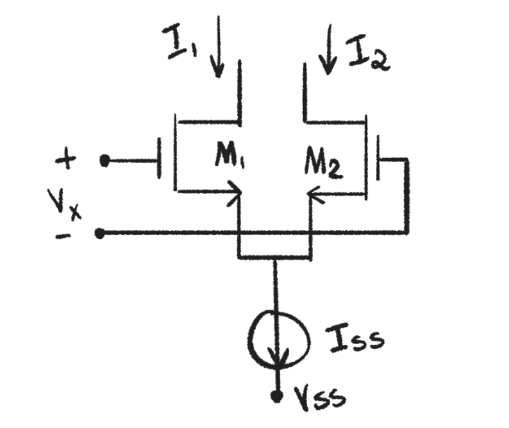
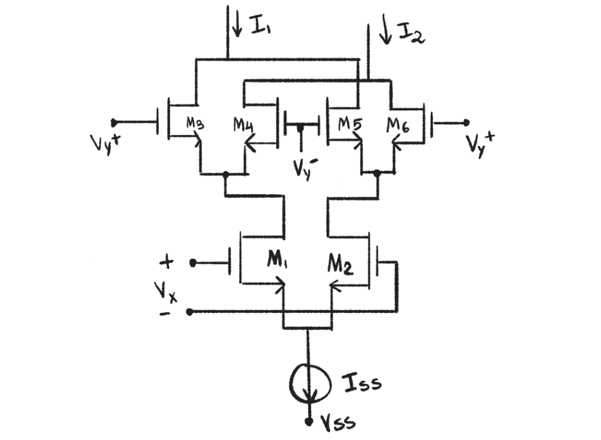
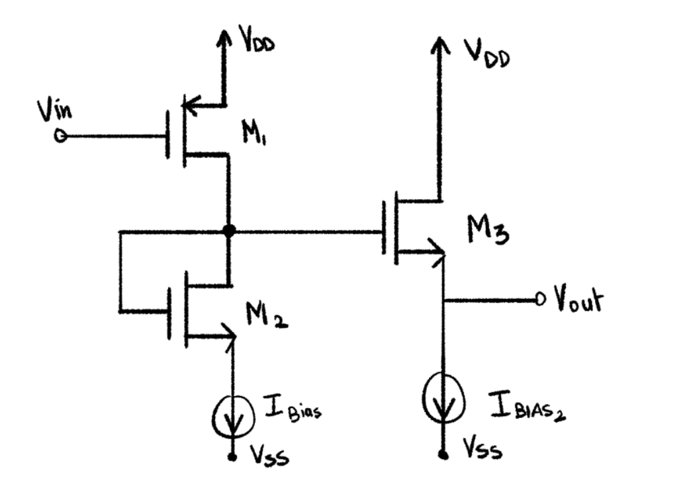

# Four-Quadrant CMOS Analog Multiplier

This repository presents the design of Four-Quadrant CMOS Analog Multiplier based on Gilbert Cell implemented using Synopsis Custom Compiler on 28nm CMOS Technology.

# Introduction:

Bipolar version of the Gilbert cell [1] has been
successfully used for many years in the form of analog
multipliers. Replacing the Bipolar Junction Transistors with
MOSFETs heavily limits the range of the differential input
signals. This is because the output current of the MOS
differential pair depends non-linearly on the tail bias current
and the input signal. The MOS analog multiplier is however
an extremely useful circuit in integrated VLSI systems. In
this paper an attempt has been made to increase the input
range of the signal swing by employing attenuating stages
which reduce the input signal levels before giving the input
into the Gilbert cell stage.

# MOS Differential Pair:

The circuit diagram of the MOS Differential Pair is shown in Fig. 1. The sum of the currents flowing through both MOSFETs is constant and equal to the tail current. Under Zero signal conditions, by symmetry half of the Tail current flows in each of the MOSFETs.

 
  Fig. 1: MOS Differential Pair 

With simple analysis it can be proven that when a differential input voltage signal is applied, the differential output current is represented by the equation: 

  

Where,

  

The equation is valid as long as,

  

Beyond which the complete tail current will flow in either of the MOSFETs.

For a small signal Vx the differential output current can be approximated to be linear with Vx. Therefore, this circuit can be considered as a current steering circuit.

# Gilbert Cell:

The Gilbert cell uses Three of these differential
pairs and two inputs to steer tail currents depending on the
two inputs.

 
  Fig. 2: MOS Gilbert Cell

# Attenuator:

A PMOS transistor in the common source configuration with a diode connected NMOS transistor can be used either as an amplifier or attenuator by appropriately varying the device aspect ratio. The configuration is followed by a NMOS source follower.

 
  Fig. 3: Attenuator Circuit

The gain of the given configuration is:

  

This gain formula is valid even for fairly large voltage swings at the input. For attenuation, the denominator term must be greater than the numerator term and this can be achieved by making the aspect ratio of the NMOS device larger than that of the PMOS device.

# Tools Used:

<b>• Synopsys Custom Compiler:</b> 
&emsp;The Synopsys Custom Compiler™ design environment is a modern solution for full-custom analog, custom digital, and mixed-signal IC design. As the heart of the Synopsys Custom Design Platform, Custom Compiler provides design entry, simulation management and analysis, and custom layout editing features. This tool was used to design the circuit on a transistor level.

<b>• Synopsys Primewave:</b> 
&emsp;PrimeWave™ Design Environment is a comprehensive and flexible environment for simulation setup and analysis of analog, RF, mixed-signal design, custom-digital and memory designs within the Synopsys Custom Design Platform. This tool helped in various types of simulations of the above designed circuit.

<b>• Synopsys 28nm PDK:</b> 
&emsp;The Synopsys 28nm Process Design Kit(PDK) was used in creation and simulation of the above designed circuit.

<b>• Krita:</b> 
&emsp;Digital hand-drawn circuit diagrams used for illustration were made using Krita graphics editor.

# Author:
• Salai Pragadeshwaran B, B.Tech(ECE), National Institute of Technology, Trichy-620015.

# Acknowledgements:
• <a href='https://www.iith.ac.in/events/2022/02/15/Cloud-Based-Analog-IC-Design-Hackathon/'>Cloud Based Analog IC Design Hackathon</a> 
• <a href='https://www.synopsys.com/'>Synopsys India</a> 
• <a href='https://www.vlsisystemdesign.com/'>VLSI System Design (VSD) Corp. Pvt. Ltd India</a> 

# References:
[1] B. Gilbert, “A high-performance monolithic multiplier using active
feedback,” IEEE J. Solid-State Circuits, vol. SC-9, pp. 364-373, Dec.
1974.

[2] SHI-CAI QIN ANDRANDY L. GEIGER, A +-5-V CMOS Analog
Multiplier, IEEE Journal of Solid State Circuits, vol SC-22, pp.1143–
1146, Dec. 1987.

[3] Razavi, Behzad. 2001. Design of analog CMOS integrated circuits.
Boston, MA: McGraw-Hill.
